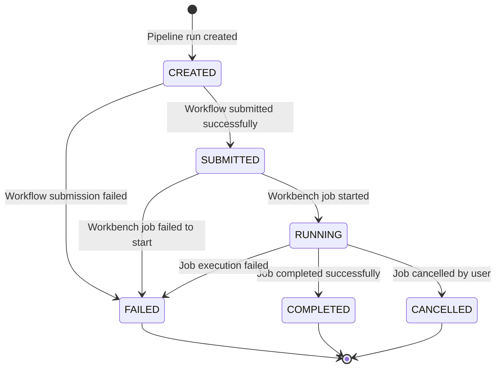

# Design Document: Batch Pipeline Processing System

## Overview

This design extends the existing microservices architecture to support batch pipeline processing through workbench integration. The solution builds upon the current FastAPI ingestion service, PostgreSQL database, and Conductor workflow orchestration to add batch processing capabilities with automated status monitoring.

The system introduces three main components:
1. **Batch Conductor Workflow** - Orchestrates batch job submission to workbench API
2. **Enhanced Pipeline Run Endpoint** - Extends existing API to handle batch mode submissions  
3. **Status Polling Worker Service** - Background service for automated status monitoring

## Architecture

```mermaid
graph TB
    subgraph "Existing Infrastructure"
        API[Ingestion API<br/>FastAPI]
        DB[(PostgreSQL<br/>Database)]
        CONDUCTOR[Conductor Server<br/>Workflow Engine]
        MINIO[MinIO<br/>File Storage]
    end
    
    subgraph "New Components"
        BATCH_WF[Batch Conductor<br/>Workflow]
        WORKER[Status Polling<br/>Worker Service]
        WORKBENCH[Workbench API<br/>External Service]
    end
    
    subgraph "Client Layer"
        CLIENT[Client Application]
    end
    
    CLIENT -->|POST /pipeline-run| API
    CLIENT -->|GET /pipeline-run/{id}| API
    
    API -->|Create PipelineRun| DB
    API -->|Submit Workflow| CONDUCTOR
    API -->|Query Status| DB
    
    CONDUCTOR -->|Execute| BATCH_WF
    BATCH_WF -->|Submit Job| WORKBENCH
    WORKBENCH -->|Return job_id| BATCH_WF
    
    WORKER -->|Poll Status| DB
    WORKER -->|Query Job Status| WORKBENCH
    WORKER -->|Update Records| DB
    
    BATCH_WF -.->|Store job_id| DB
```

## Components and Interfaces

### 1. Batch Conductor Workflow

**Purpose**: Orchestrates batch job submission to the workbench API and captures the returned job ID.

**Workflow Definition**:
```json
{
  "name": "batch_pipeline_workflow",
  "version": 1,
  "tasks": [
    {
      "name": "submit_batch_job",
      "taskReferenceName": "submit_batch_job_ref",
      "type": "HTTP",
      "inputParameters": {
        "http_request": {
          "uri": "${workflow.input.workbench_api_url}/batch/submit",
          "method": "POST",
          "body": {
            "pipeline_run_id": "${workflow.input.pipeline_run_id}",
            "input_path_prefix": "${workflow.input.input_path_prefix}",
            "output_path_prefix": "${workflow.input.output_path_prefix}",
            "report_path_prefix": "${workflow.input.report_path_prefix}"
          },
          "headers": {
            "Content-Type": "application/json"
          }
        }
      }
    }
  ],
  "outputParameters": {
    "workbench_job_id": "${submit_batch_job_ref.output.response.body.workbench_job_id}",
    "status": "${submit_batch_job_ref.output.response.body.status}"
  }
}
```

**Input Parameters**:
- `pipeline_run_id`: Integer ID of the pipeline run record
- `input_path_prefix`: String path for input data location
- `output_path_prefix`: String path for output data location  
- `report_path_prefix`: Optional string path for report output
- `workbench_api_url`: Base URL for workbench API

**Output Parameters**:
- `workbench_job_id`: String identifier returned by workbench API
- `status`: Initial job status from workbench

### 2. Enhanced Pipeline Run Endpoint

**Endpoint**: `POST /pipeline-run`

**Enhanced Logic Flow**:
```python
def create_pipeline_run(payload: PipelineRunRequest, db: Session):
    # Existing logic for pipeline validation and record creation
    pipeline = validate_pipeline_exists(payload.pipeline_id, db)
    pipeline_run = create_pipeline_run_record(payload, db)
    
    # New batch processing logic
    if pipeline.mode == PipelineMode.BATCH:
        workflow_input = {
            "pipeline_run_id": pipeline_run.id,
            "input_path_prefix": payload.input_path_prefix,
            "output_path_prefix": payload.output_path_prefix,
            "report_path_prefix": payload.report_path_prefix,
            "workbench_api_url": get_workbench_api_url()
        }
        
        try:
            conductor_response = submit_conductor_workflow(
                workflow_name=pipeline.workflow_name,
                workflow_input=workflow_input
            )
            
            # Extract workbench_job_id from conductor response
            workbench_job_id = extract_workbench_job_id(conductor_response)
            
            # Update pipeline run with job ID and status
            update_pipeline_run_status(
                pipeline_run_id=pipeline_run.id,
                status=PipelineRunStatus.SUBMITTED,
                workbench_job_id=workbench_job_id,
                started_at=datetime.now(timezone.utc),
                db=db
            )
            
        except Exception as e:
            update_pipeline_run_status(
                pipeline_run_id=pipeline_run.id,
                status=PipelineRunStatus.FAILED,
                error_message=str(e),
                db=db
            )
            raise HTTPException(status_code=500, detail=f"Batch workflow submission failed: {e}")
    
    # Existing realtime logic remains unchanged
    elif pipeline.mode == PipelineMode.REALTIME:
        return handle_realtime_pipeline(payload)
    
    return pipeline_run
```

**New Status Query Endpoint**: `GET /pipeline-run/{pipeline_run_id}`

```python
def get_pipeline_run_status(pipeline_run_id: int, db: Session):
    pipeline_run = db.query(PipelineRun).filter(PipelineRun.id == pipeline_run_id).first()
    
    if not pipeline_run:
        raise HTTPException(status_code=404, detail="Pipeline run not found")
    
    return PipelineRunResponse(
        id=pipeline_run.id,
        pipeline_id=pipeline_run.pipeline_id,
        status=pipeline_run.status,
        workbench_job_id=pipeline_run.workbench_job_id,
        error_message=pipeline_run.error_message,
        user_storage_input_path_prefix=pipeline_run.user_storage_input_path_prefix,
        user_storage_output_path_prefix=pipeline_run.user_storage_output_path_prefix,
        user_storage_report_path_prefix=pipeline_run.user_storage_report_path_prefix,
        started_at=pipeline_run.started_at,
        completed_at=pipeline_run.completed_at
    )
```

### 3. Status Polling Worker Service

**Service Architecture**:
```python
class BatchStatusWorker:
    def __init__(self):
        self.db_session = get_database_session()
        self.workbench_client = WorkbenchAPIClient()
        self.polling_interval = 30  # seconds
        self.max_retries = 3
        self.retry_delay = 5  # seconds
    
    async def run_polling_loop(self):
        while True:
            try:
                await self.poll_and_update_statuses()
                await asyncio.sleep(self.polling_interval)
            except Exception as e:
                logger.error(f"Polling loop error: {e}")
                await asyncio.sleep(self.retry_delay)
    
    async def poll_and_update_statuses(self):
        # Query for active pipeline runs
        active_runs = self.get_active_pipeline_runs()
        
        for pipeline_run in active_runs:
            try:
                await self.update_pipeline_run_status(pipeline_run)
            except Exception as e:
                logger.error(f"Failed to update pipeline run {pipeline_run.id}: {e}")
                continue
    
    def get_active_pipeline_runs(self):
        return self.db_session.query(PipelineRun).filter(
            PipelineRun.status.in_([
                PipelineRunStatus.SUBMITTED,
                PipelineRunStatus.RUNNING
            ])
        ).all()
    
    async def update_pipeline_run_status(self, pipeline_run):
        if not pipeline_run.workbench_job_id:
            logger.warning(f"Pipeline run {pipeline_run.id} has no workbench_job_id")
            return
        
        # Call workbench API with retry logic
        job_status = await self.get_workbench_job_status_with_retry(
            pipeline_run.workbench_job_id
        )
        
        # Update database record
        self.update_database_record(pipeline_run, job_status)
    
    async def get_workbench_job_status_with_retry(self, workbench_job_id):
        for attempt in range(self.max_retries):
            try:
                return await self.workbench_client.get_job_status(workbench_job_id)
            except Exception as e:
                if attempt == self.max_retries - 1:
                    raise e
                await asyncio.sleep(self.retry_delay * (2 ** attempt))
```

**Docker Configuration**:
```dockerfile
FROM python:3.9-slim
WORKDIR /app
COPY requirements.txt .
RUN pip install --no-cache-dir -r requirements.txt
COPY . .

EXPOSE 9000
CMD ["python", "worker.py"]
```

## Data Models

The existing database models require minimal changes. The `PipelineRun` model already includes the necessary fields:

**Existing PipelineRun Model** (no changes needed):
```python
class PipelineRun(Base):
    __tablename__ = "pipeline_runs"
    
    id = Column(Integer, primary_key=True, index=True)
    pipeline_id = Column(Integer, ForeignKey("pipelines.id"), nullable=False)
    status = Column(Enum(PipelineRunStatus), nullable=False, default=PipelineRunStatus.CREATED)
    workbench_job_id = Column(String(255), nullable=True)  # Already exists
    error_message = Column(Text, nullable=True)
    user_storage_input_path_prefix = Column(String(1024), nullable=True)
    user_storage_output_path_prefix = Column(String(1024), nullable=True)
    user_storage_report_path_prefix = Column(String(1024), nullable=True)
    started_at = Column(DateTime(timezone=True), nullable=True)
    completed_at = Column(DateTime(timezone=True), nullable=True)
    created_at = Column(DateTime(timezone=True), server_default=func.now())
    updated_at = Column(DateTime(timezone=True), server_default=func.now(), onupdate=func.now())
```

**Status Flow Diagram**:


## Correctness Properties

*A property is a characteristic or behavior that should hold true across all valid executions of a system-essentially, a formal statement about what the system should do. Properties serve as the bridge between human-readable specifications and machine-verifiable correctness guarantees.*

Now I need to analyze the acceptance criteria to determine which ones can be tested as properties.
